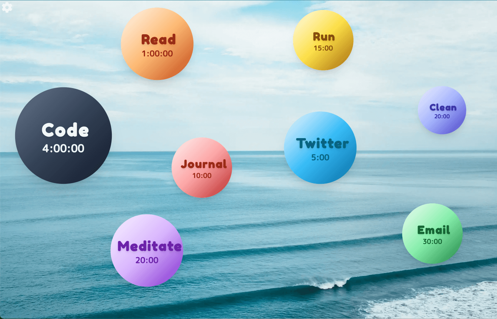

# ConsistenSea - New tab chrome extension to help you stay consistent with your habits.

Keep your habits afloat with ConsistenSea!

I designed it to be very simple, no extraneous
features, just an easy way to keep track of your daily habits, and
master the art of showing up every single day. Even 10 minutes a
day of action will lead you further than your peers.

I made this app for myself, I found that I constantly forgot to
check my habit trackers everyday, so having it on every new tab
was the best way to remember. This Repo is open source and MIT licensed, do whatever you want with it. Feel free to send pull requests, I'd love to see the community contribute and make it better. Create an issue or fill out a feedback form in the app if
you have feedback or feature requests, I will get back to you as
soon as I can. I hope you enjoy it!

### “It's not what we do once in a while that shapes our lives. It's what we do consistently.” ― Tony Robbins
